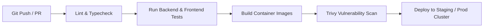

# SIID Enterprise Real Product Development Standards & Architectural Blueprint

This document defines the real-world production development standards, architectural patterns, and operational procedures for the **SIID** platform across **Frontend**, **Backend**, **Database**, and **DevOps Infrastructure**.

---

## 1. Engineering Principles & Code Quality

### 🔷 Frontend (Next.js 15 App Router + React 18 + TypeScript)
- **Strict Type System**: No implicit `any` types. All API payloads, component props, and context states must be typed using explicit interface definitions in `@/types/` or inline generic bindings.
- **Component Hierarchy**:
  - UI primitives in `@/components/ui/` (Shadcn design system).
  - Feature widgets in `@/components/` (e.g. `video-carousel.tsx`, `progress-analytics.tsx`).
  - View pages in `app/` using route segments (`page.tsx`, `layout.tsx`, `loading.tsx`, `error.tsx`).
- **Error Boundaries**: Every page route level must be wrapped with `<ErrorBoundary>` to isolate client-side rendering failures without crashing the root application layout.
- **SEO & Accessibility (a11y)**: Every page includes OpenGraph metadata cards, dynamic title templates, canonical tags, WCAG 2.1 AAA contrast ratios, and valid ARIA attributes.

### 🐍 Backend (FastAPI + Pydantic v2 + SQLAlchemy ORM)
- **API Versioning**: All REST endpoints are versioned under `/api/v1/`. Breaking changes must launch under `/api/v2/`.
- **Contract Decoupling**: API request/response contracts (`schemas.py`) are strictly decoupled from underlying database entities (`models.py`).
- **Global Error Handling**: Unhandled runtime exceptions and HTTP exceptions are intercepted by FastAPI global exception handlers returning standardized RFC 7807 JSON error responses:
  ```json
  {
    "success": false,
    "error": {
      "code": 404,
      "message": "Project resource not found",
      "timestamp": "2026-08-25T13:30:00Z"
    }
  }
  ```
- **Response Headers**: All HTTP responses include `X-Response-Time` latency metrics for real-time performance tracking.

---

## 2. Database Migration & Data Integrity Lifecycle

### 🗄️ Database Standards (MySQL 8.0 / SQLite Dev)
1. **Connection Pooling**:
   - `pool_pre_ping=True` enabled to eliminate stale connection drops.
   - `pool_recycle=3600`, `pool_size=5`, `max_overflow=10`.
2. **Schema Migration via Alembic**:
   - Never run manual DDL (`ALTER TABLE`) in production database environments.
   - Generate migration files via:
     ```bash
     cd backend
     alembic revision --autogenerate -m "Add new feature columns"
     alembic upgrade head
     ```
3. **Indexing Strategy**:
   - Mandatory primary key index (`id`).
   - Unique hash index on lookup attributes (e.g., `User.email`).
   - Foreign key constraint definitions with cascade behaviors (`cascade="all, delete-orphan"`).

---

## 3. Security & OWASP Protection Checklist

| Security Control | Implementation |
| :--- | :--- |
| **Authentication** | OAuth2 Bearer Tokens with JWT (HS256 signature, 24h expiration). |
| **Password Hashing** | Bcrypt salted hashing via Passlib. |
| **CORS Policy** | Explicit domain whitelist in `ALLOWED_ORIGINS` (No wildcard `*` in production). |
| **Input Sanitization** | Pydantic data validation rejecting unexpected request fields (`extra = "ignore"`). |
| **Health Probes** | Separate `/healthz` (liveness) and `/api/v1/health` (readiness) endpoints. |
| **Security Headers** | `X-Content-Type-Options: nosniff`, `X-Frame-Options: DENY`, `X-XSS-Protection`. |

---

## 4. DevOps, CI/CD & Container Orchestration

### 🐳 Containerization Strategy
- **Backend Container**: Multi-stage Python 3.11 lightweight image with non-root user execution (`backend/Dockerfile`).
- **Frontend Container**: Multi-stage Node.js Next.js standalone runner (`frontend/Dockerfile`).
- **Docker Compose**: Orchestrated via `docker-compose.yml` with healthchecks (`healthz`), restart policies (`unless-stopped`), and volume persistence.

### 🔄 CI/CD Pipeline Workflow (GitHub Actions)


---

## 5. Observability, Logging & Monitoring

- **Structured Logging**: Standard python `logging` module configured with JSON/text format, timestamping, and configurable log levels (`LOG_LEVEL=INFO`).
- **Real-Time Monitoring**: Integrate Sentry DSN (`SENTRY_DSN`) for automated error tracking and alert dispatching.
- **Latency Tracking**: Inspect `X-Response-Time` header on API responses to flag endpoints with latency exceeding 200ms.
